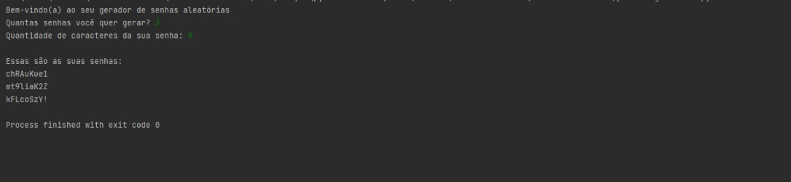

# Password Generator (Gerador de Senhas)

## Sobre o projeto:
### Nesse projeto foi feito um gerador de senhas aleatórias, onde o usuário pode escolher a quantidade de senhas desejadas e o número de caracteres que as senhas terão.

## Como executar o projeto:
### Pré-requisitos: Python 3 e um editor de código
- Coloque o código no esditor de texto de sua preferência;
- Acrescente ou remova caracteres que você queira que possam aparecer nas suas senhas;
- Rode o código no editor. 

